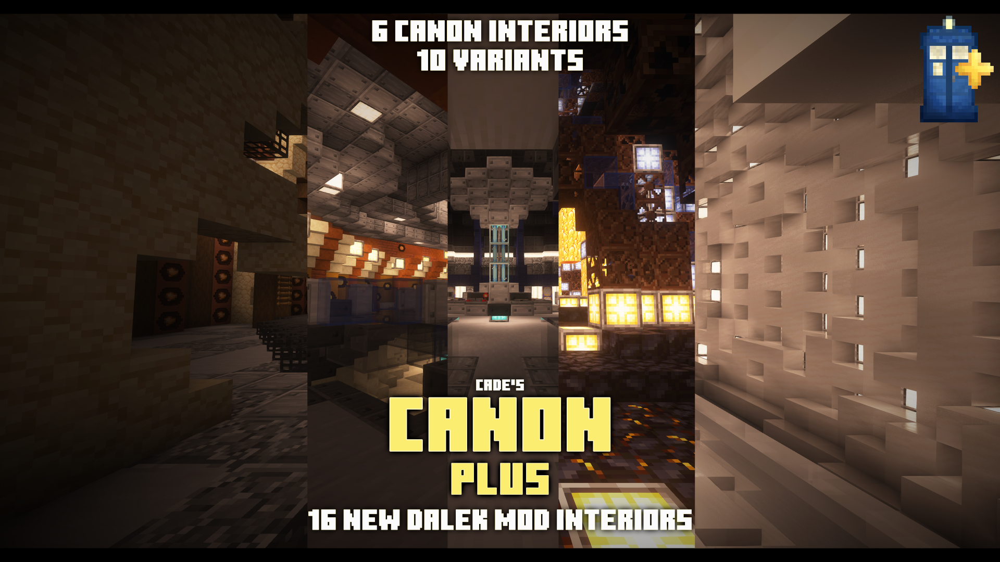
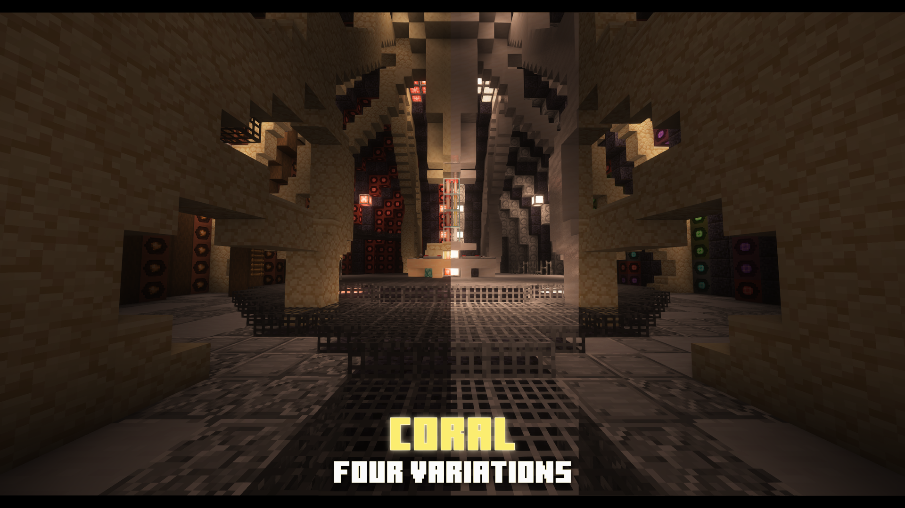
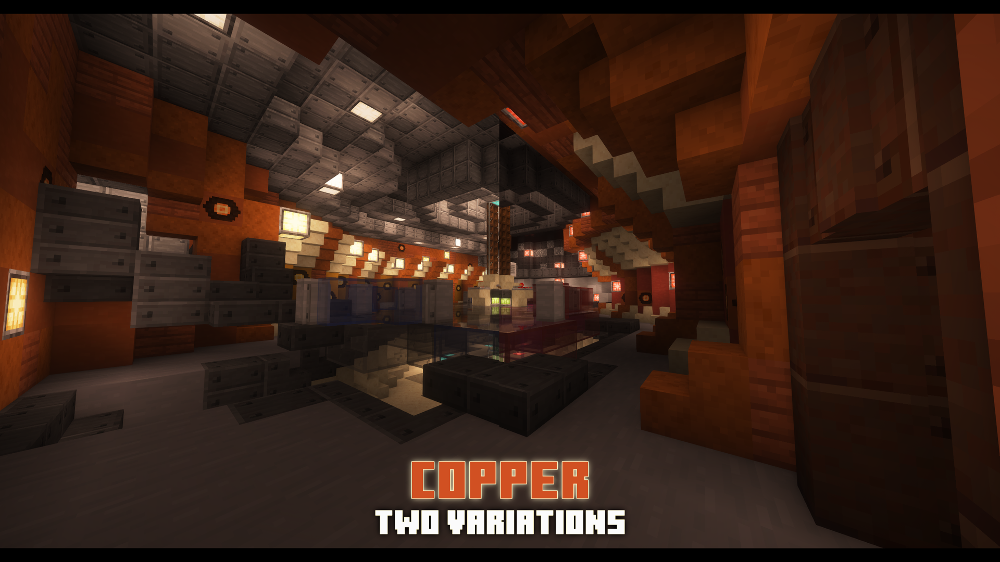
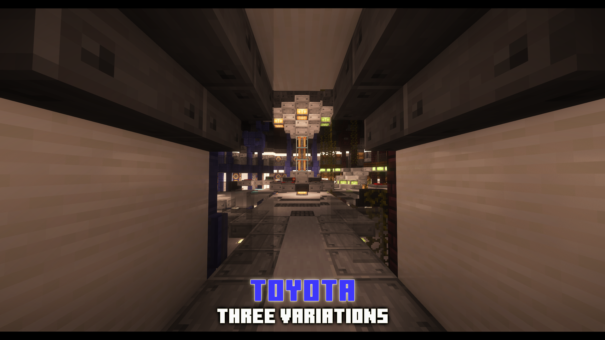
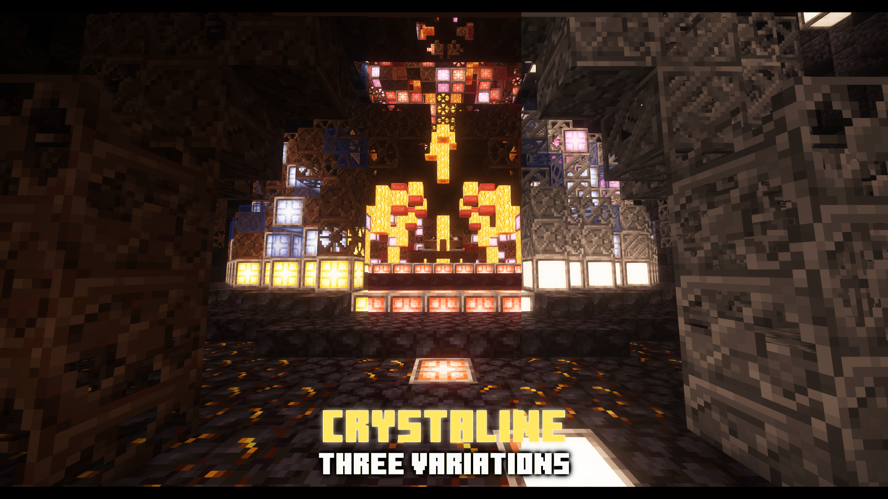
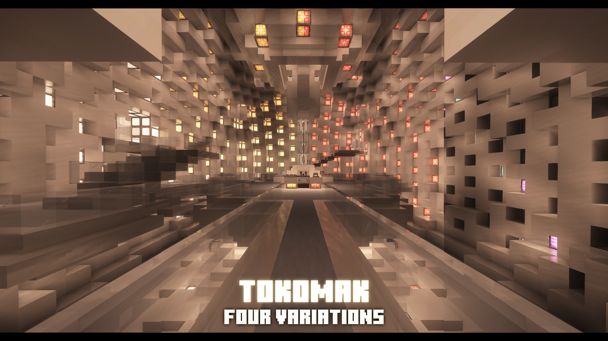

# DM – Canon Plus

Adds 16 new TARDIS interiors to the Dalek Mod — 6 canon designs and 10 unique variations!

## Features
- 16 fully-functional interiors for the TARDIS
- 6 canon interiors faithful to Doctor Who lore
- 10 custom variations to expand your options

## Interior Showcase

## Requirements
- Minecraft 1.16.5
- Forge 36 or newer
- Dalek Mod U70+ (latest version)

## Credits

**Mod Author:** CadeXR

**Dalek Mod Developers:** SwdTeam
